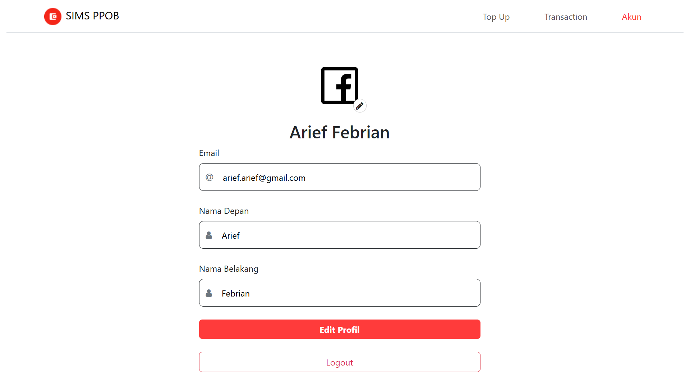
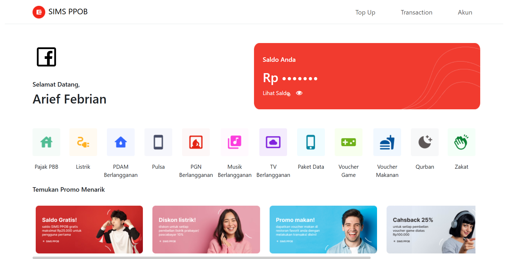
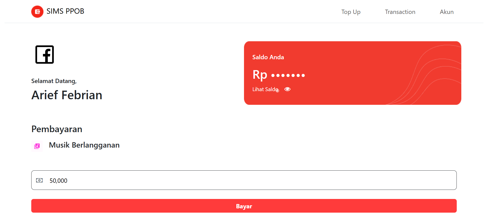
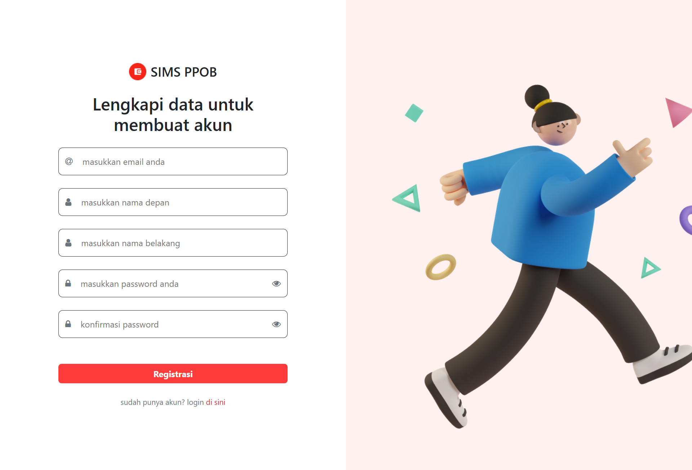
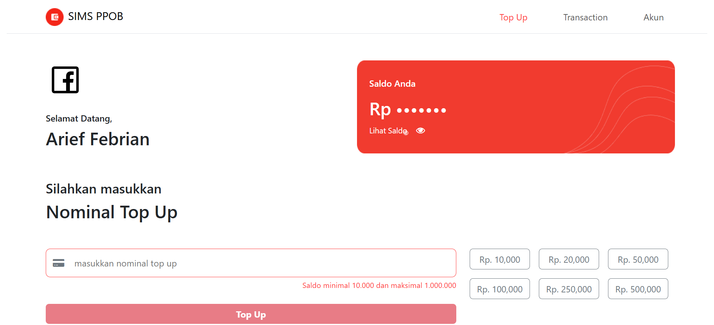
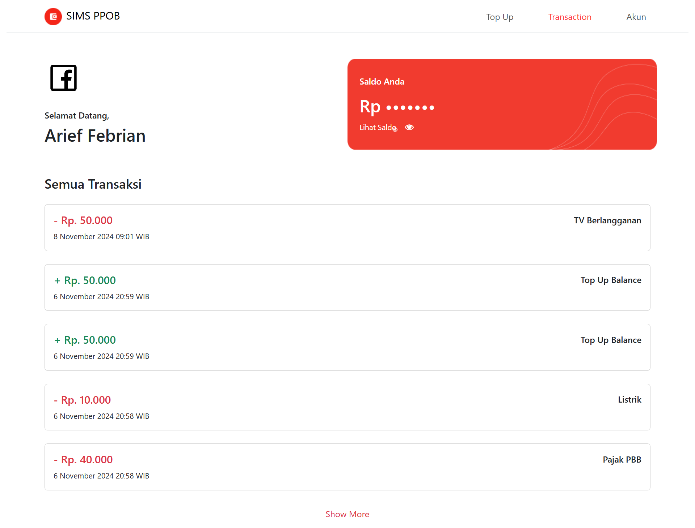

# SIMS PPOB Arief Febrian

This is a simple transaction app that i build using **React JS**. I implement redux in this project so i can easily maintain the state i use for everything

## Preview

## Key Features

- Login and Registration validation based on the JSON response
- Redux state management
- Routing management and component based element

